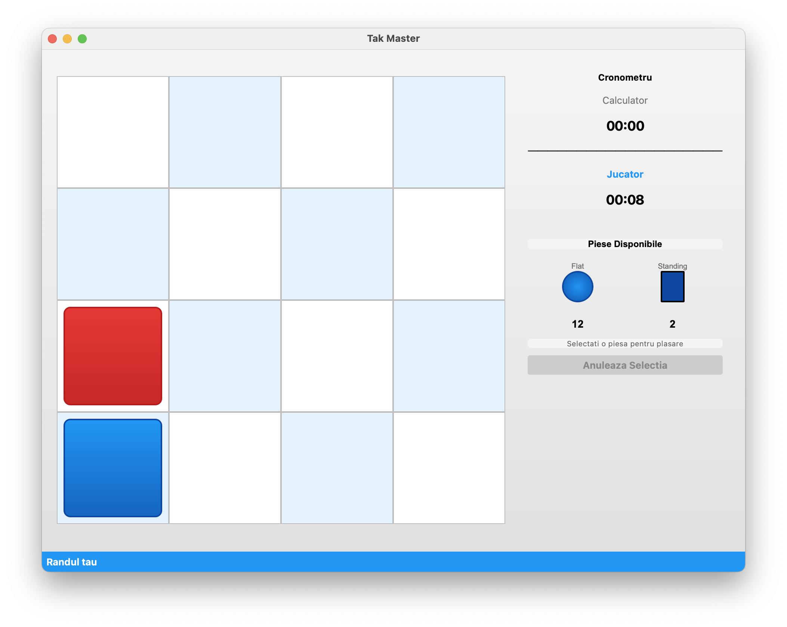
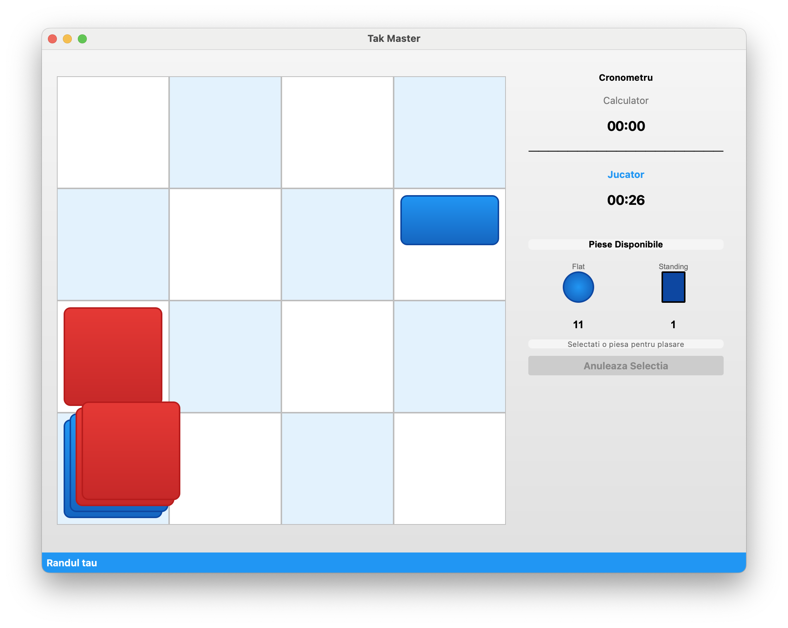

# Tak Master

În **Tak**, jucătorii își propun să conecteze două margini opuse ale tablei cu piese numite „pietre” și să creeze un drum. 
Jucătorii își așază pe rând propriile pietre și construiesc un drum, în timp ce blochează și capturează pietrele adversarului. 
Stacking și unstacking vertical al pietrelor conferă un element tridimensional jocului.


## Screenshots

### Meniu 


### Tabla de joc


### Stacking


## Instalare

1. **Clonează repo-ul**
```bash
git clone https://github.com/antoninIva/proiectIA.git
cd proiectIA
```

2. **Creează un virtual environment**
```bash
python -m venv venv
source venv/bin/activate
```

3. **Instalează dependențele**
```bash
pip install -r requirements.txt
```

## Rulare

### Quick Start
```bash
python main.py
```

### Reguli

1. **Plasare piese:**
   - Piese **Flat** pot fi plasate pe poziții goale SAU peste alte piese Flat 
   - Piese **Standing** pot fi plasate dor pe poziții goale
   - Nu se poate plasa nicio piesă peste o piesă Standing

2. **Mutare piese:**
   - Doar piesele Flat pot fi mutate
   - O piesă poate fi mutată doar dacă este pe vârf 

3. **Condiții de victorie:**
   - Completarea unei linii, coloane sau diagonale cu piese Flat
   - Doar piesa de sus la fiecare poziție contează pentru victorie


## Structura proiectului

```
proiectIA/
├── main.py                      # Entry point al aplicației
├── GameClasses.py               # Logica jopcului 
├── requirements.txt             # Dependențe Python
│
├── ui/                          # Modul interfață grafică
│   ├── __init__.py              # Inițializare modul UI
│   ├── game_window.py           # Fereastra principală a jocului
│   ├── board_widget.py          # Widget pentru tabla de joc
│   ├── piece_inventory_widget.py # Widget pentru inventarul de piese
│   ├── timer_widget.py          # Widget pentru cronometru
│   ├── action.py                # Sistem de acțiuni pentru AI
│   ├── minimax_wrapper.py       # Wrapper pentru algoritmul Minimax
│   ├── minimax_worker.py        # Worker thread pentru AI
│   ├── start_dialog.py          # Dialog de start joc
│   └── difficulty_dialog.py     # Dialog pentru selectare dificultate
```